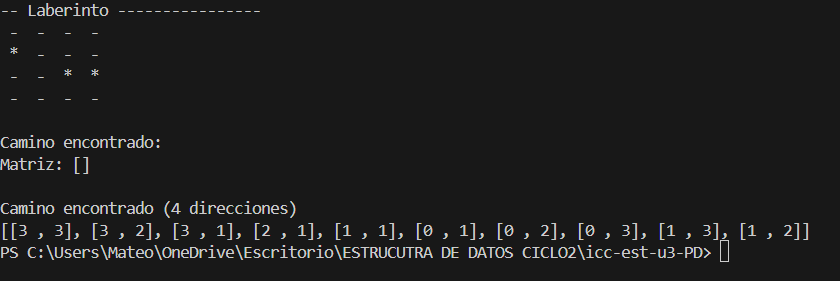

# Universidad Politécnica Salesiana
# Estructura de Datos - Ciclo 2

---

**Nombre:** Mateo Morejon 

**Fecha:** 16 de julio de 2025  
**Tema:** Programación Dinámica - Fibonacci Recursivo y con Memoización

---

## IMAGEN 1

## IMAGEN 2

## Resumen

En este proyecto se implementaron dos versiones del cálculo de la serie de Fibonacci en Java:

1. **Fibonacci Recursivo:**  
   Se utiliza una función recursiva simple que llama a sí misma para calcular el valor de Fibonacci de un número `n`. Esta versión es sencilla pero ineficiente para valores grandes, ya que recalcula muchas veces los mismos valores, lo que genera una complejidad exponencial.

2. **Fibonacci con Programación Dinámica (Memoización):**  
   Se utiliza un mapa (`HashMap`) para almacenar los resultados ya calculados de la función de Fibonacci. Así, cada vez que se necesita un valor ya calculado, se recupera directamente del mapa, evitando cálculos repetidos y mejorando drásticamente la eficiencia. Esta técnica reduce la complejidad a O(n).

### Resultados de Ejemplo

- **Fibonacci Recursivo (n=50):**  
  Resultado: 12586269025  
  Tiempo de ejecución: (puede ser muy alto)

- **Fibonacci con Memoización (n=50):**  
  Resultado: 12586269025  
  Tiempo de ejecución: (muy bajo comparado con el recursivo)

---

## Conclusión

La programación dinámica permite optimizar algoritmos recursivos costosos, como el cálculo de Fibonacci, mediante el almacenamiento de resultados intermedios. Esto demuestra la importancia de elegir la técnica adecuada para resolver problemas de eficiencia en programación.

---

**¡Gracias por revisar mi trabajo!**
